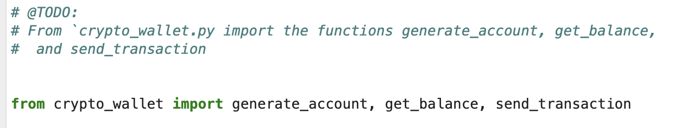
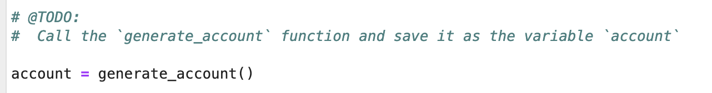
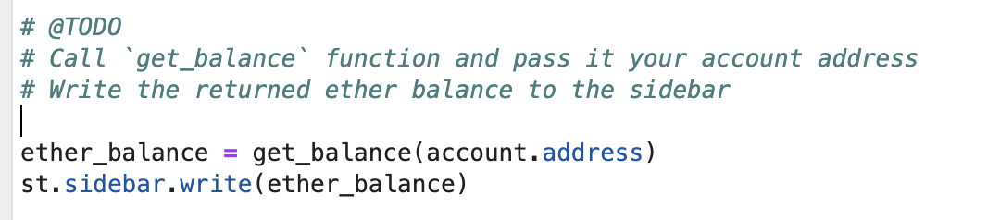
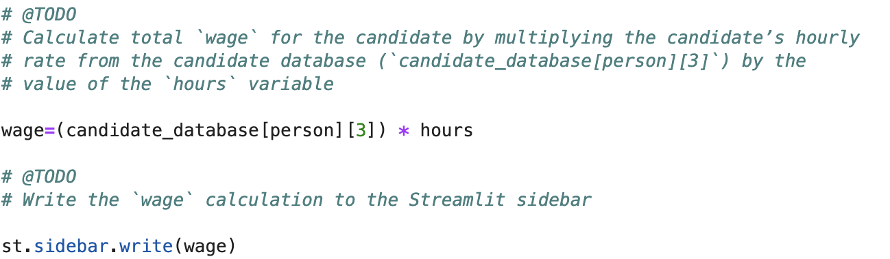
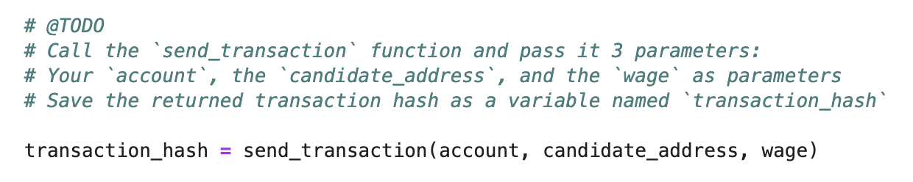
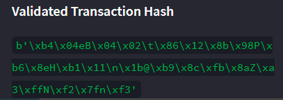
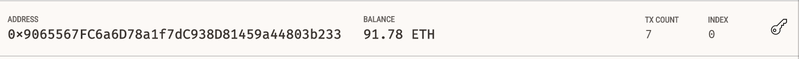
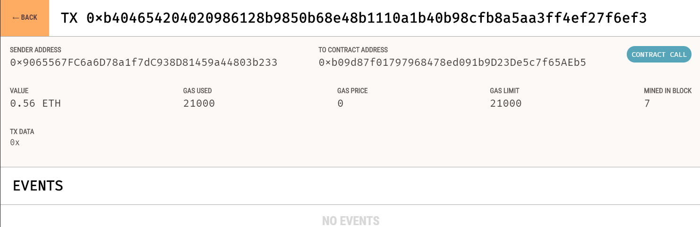
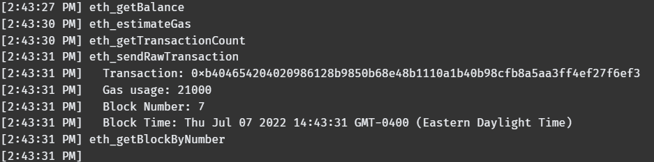
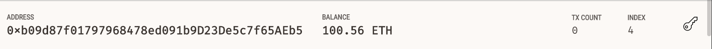

# Fintech Finder

📌 Challenge 19

I work at a startup that is building a new and disruptive platform called Fintech Finder. Fintech Finder is an application that its customers can use to find fintech professionals from among a list of candidates, hire them, and pay them. As Fintech Finder’s lead developer, I have been tasked with integrating the Ethereum blockchain network into the application in order to enable our customers to instantly pay the fintech professionals whom they hire with cryptocurrency.

In this Challenge, I will complete the code that enables our customers to send cryptocurrency payments to fintech professionals. To develop the code and test it out, I will assume the perspective of a Fintech Finder customer who is using the application to find a fintech professional and pay them for their work.

---

## Overview of the project 

In order to accomplish this, I will assume the perspective of a Fintech Finder customer in order to do the following:

To complete this Challenge, I am using two Python files:
1. [fintech_finder.py](Starter_Code/fintech_finder.py)  contains the code associated with the web interface of the application. The code included in this file is compatible with the Streamlit library. 

2. [crypto_wallet.py](Starter_Code/crypto_wallet.py) contains the Ethereum transaction functions. By using import statements, I integrate the crypto_wallet.py Python script into the Fintech Finder interface program which is in fintech_finder.py file. 

Integrating these two files allow the user to automate the tasks associated with generating a digital wallet, accessing Ethereum account balances, and signing and sending transactions via Ethereum’s Kovan testnet.

## Project goals

 * Generate a new Ethereum account instance by using the mnemonic seed phrase taken from Ganache.
 * Fetch and display the account balance associated with your Ethereum account address.
 * Calculate the total value of an Ethereum transaction, including the gas estimate, that pays a Fintech Finder candidate for their work.
 * Digitally sign a transaction that pays a Fintech Finder candidate, and send this transaction to the Ganache blockchain.
 * Review the transaction hash code associated with the validated blockchain transaction.

## Project steps

The following steps are taken to complete this Challenge work:

### Step 1: Import Ethereum Transaction Functions into the Fintech Finder Application

##### Import generate_account, get_balance, and send_transaction from the crypto_wallet.py file. 

##### Call the generate_account function and store the account object. 

##### Call the get_balance function and pass it the Ethereum account.address. 

### Step 2: Sign and Execute a Payment Transaction

##### Calculate the transaction’s total wage. 

##### Call the send_transaction function and pass it the account, candidate_address, and wage parameters. 

##### Return the transaction hash from the send_transaction and display it on the application’s web interface. 

### Step 3: Inspect the Transaction on Etherscan

##### Send a transaction using the Fintech Finder app

https://user-images.githubusercontent.com/98414364/177853886-ce0f86fa-38b0-4294-bc54-aaab419e69c0.mov

##### Account Balance 

##### Block Details 

##### Transaction Details 

##### Log detail

##### Hired Person's Balance

